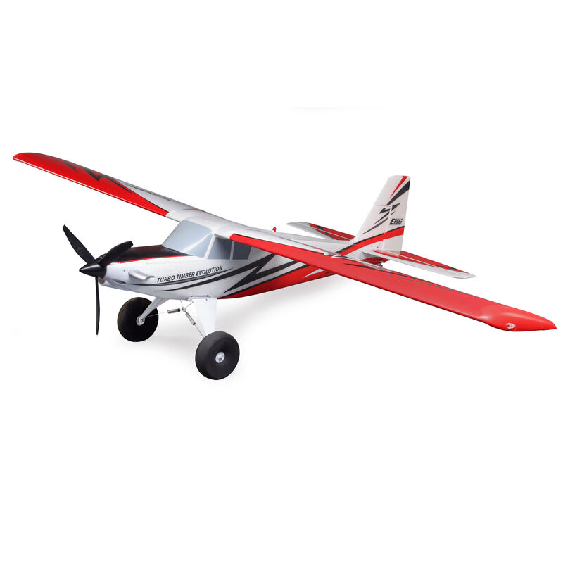
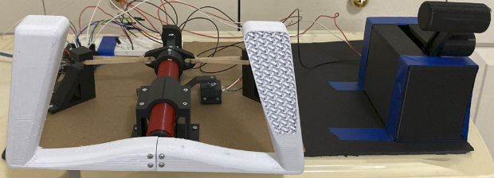

# UAVCapstonePathOne

  

This portion of our project was one we explored but ultimately set aside after more suitable options were found.

## This project used the following items:

- [Arduino Uno (1)](https://store.arduino.cc/products/arduino-uno-rev3)
- [Arduino Nano](https://store.arduino.cc/products/arduino-nano)
- [Assorted Potentiometers](https://www.amazon.com/Taiss-Potentiometer-potentiometers-Assortment-Terminal/dp/B0B1TSMDL1/ref=sr_1_3?keywords=potentiometer+assortment+kit&qid=1677274926&sprefix=potenti%2Caps%2C210&sr=8-3)
- [Adafruit RFM95W LoRa Radio Transceiver Breakout Board (2)](https://www.adafruit.com/product/3072)
- [LM303 Accelerometer+Magnetometer(Compass)](https://www.adafruit.com/product/1120)
- [Turbo Timber Airframe](https://www.horizonhobby.com/product/turbo-timber-evolution-1.5m-bnf-basic-includes-floats/EFL105250.html)

## This project also used a 3d printed flight yoke found on thingiverse

  

- [3d Printed Flight Yoke](https://www.thingiverse.com/thing:4855469)
- [3d Printed Throttle Quadrant](https://www.thingiverse.com/thing:4445717)

### Note This project is incomplete and only included as a reference for future individuals who would like to pick up where we left off.
